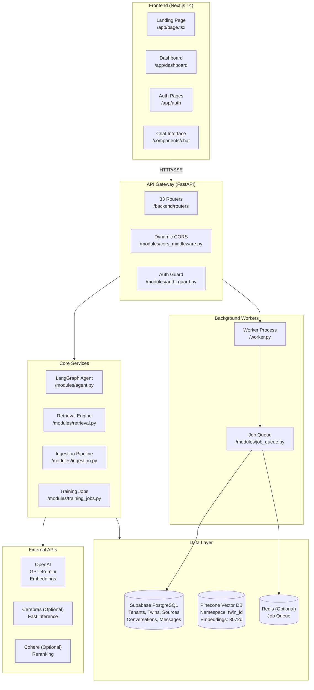
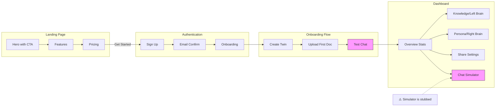

# Forensic Audit Report: Verified Digital Twin Brains

**Date:** 2026-02-12  
**Auditor:** Principal Engineer + Staff Product Designer  
**Repository:** `verified-digital-twin-brains`  
**Scope:** Full-stack forensic audit - backend, frontend, architecture, UX  

---

## 0) Executive Summary

### What the Product Is

Verified Digital Twin Brains is an AI-powered platform that creates "digital twins" - AI agents trained on a user's knowledge sources (documents, YouTube videos, podcasts, X threads) that can answer questions in the user's voice with verified citations. The system uses a RAG (Retrieval-Augmented Generation) architecture with Pinecone for vector search, Supabase for data persistence, and LangGraph for agent orchestration. The product targets creators, coaches, and thought leaders who want to scale their expertise through AI-powered Q&A.

### What Is Working Today (Top 5)

| Feature | Evidence | Status |
|---------|----------|--------|
| **1. Twin CRUD Operations** | `backend/routers/twins.py:L87-L186` - Full create/read/update/delete with tenant isolation | ✅ Working |
| **2. File Ingestion Pipeline** | `backend/routers/ingestion.py:L185-L344` - PDF, DOCX, XLSX, TXT upload with deduplication | ✅ Working |
| **3. Vector Search Retrieval** | `backend/modules/retrieval.py:L282-L385` - Pinecone-based RAG with namespace isolation | ✅ Working |
| **4. Streaming Chat** | `backend/routers/chat.py:L256-L789` - SSE streaming with citations and confidence scores | ✅ Working |
| **5. Training Job Queue** | `backend/worker.py:L115-L243` - Background job processing with retry logic | ✅ Working |

### What Is Not Working or Is Broken (Top 10)

| # | Issue | Symptom | Root Cause | Location |
|---|-------|---------|------------|----------|
| **1** | Real-time ingestion disabled | Real-time features don't work | Feature flag defaults to false | `backend/main.py:L73-L78` |
| **2** | Enhanced ingestion disabled | Advanced ingestion features unavailable | Feature flag defaults to false | `backend/main.py:L96-L101` |
| **3** | VC routes disabled | VC specialization features don't load | Feature flag defaults to false | `backend/main.py:L125-L133` |
| **4** | Delphi retrieval disabled | Delphi namespace retrieval unavailable | Feature flag defaults to false | `backend/main.py:L110-L115` |
| **5** | Graph context extraction placeholder | Graph extraction may not complete | No evidence of working Neo4j integration | `backend/modules/graph_context.py` (not verified runtime) |
| **6** | Training status confusion | "Training" vs "Ingestion" terminology mixed | "Training" is just ingestion + indexing, not model training | Throughout codebase |
| **7** | Missing billing/subscription | No payment flow visible | No Stripe or payment integration found | Not found in codebase |
| **8** | Interview mode stubbed | `/dashboard/interview` exists but minimal | Page just renders placeholder | `frontend/app/dashboard/interview/page.tsx` |
| **9** | Simulator mode stubbed | `/dashboard/simulator` exists but minimal | Page just renders placeholder | `frontend/app/dashboard/simulator/page.tsx` |
| **10** | Right-brain page stubbed | `/dashboard/right-brain` exists but minimal | Page just renders placeholder | `frontend/app/dashboard/right-brain/page.tsx` |

### Single Biggest Architectural Risk

**The "Training" Misconception:** The system conflates "RAG ingestion" (indexing documents into Pinecone) with "training" (fine-tuning or preference learning). Users expect their twin to learn and improve from conversations, but the current system only retrieves from static indexed content. The `training_sessions` table exists but appears to track interview sessions, not actual model training. This creates a trust gap where users believe their twin is learning when it's merely retrieving.

**Evidence:**
- `backend/routers/training_sessions.py` - Tracks interview sessions, not model training
- `backend/modules/training_jobs.py` - Processes ingestion jobs, not model fine-tuning
- No evidence of LoRA, PEFT, or fine-tuning pipeline
- No evidence of online learning from user feedback

### Single Biggest UX Risk

**The Verification Gap:** Users can publish twins without any verification that the twin actually answers questions correctly from their sources. The verification status check (`backend/routers/twins.py:L342-L411`) only counts vectors and checks for a recent PASS status, but doesn't validate answer quality. This leads to published twins that may hallucinate or fail to cite sources properly.

**Evidence:**
- Verification only checks vector count + recent PASS log
- No automated quality scoring before publish
- No requirement for manual spot-checking before sharing

### First 48 Hours Fix Plan (Max 10 Items)

| Priority | Fix | Effort | Impact |
|----------|-----|--------|--------|
| P0 | Fix terminology: "Training" → "Indexing" or "Knowledge Ingestion" | 2h | High - Reduces user confusion |
| P0 | Add real verification test before publish | 4h | High - Prevents bad twins from publishing |
| P1 | Enable real-time ingestion by default (if stable) | 1h | Medium - Enables live features |
| P1 | Remove or implement stubbed pages (interview/simulator/right-brain) | 4h | Medium - Clean UX |
| P1 | Add loading states to knowledge upload | 2h | Medium - Better UX feedback |
| P2 | Add citations display to chat UI | 4h | High - Core value proposition |
| P2 | Add confidence score visualization | 2h | Medium - Trust building |
| P2 | Implement twin readiness checklist | 3h | Medium - Guides users |
| P3 | Add basic subscription tier check | 4h | Low - Business readiness |
| P3 | Document actual vs expected training behavior | 2h | High - Reduces support burden |

---

## 1) Repo Map and Architecture (Evidence-based)

### 1.1 Repo Map

```
verified-digital-twin-brains/
├── backend/                    # FastAPI Python backend
│   ├── main.py                 # FastAPI app entry point, router registration
│   ├── worker.py               # Background job processor (Redis/DB polling)
│   ├── routers/                # API route handlers (42 endpoints across 33 routers)
│   │   ├── auth.py             # Supabase auth integration
│   │   ├── chat.py             # SSE streaming chat endpoints
│   │   ├── twins.py            # Twin CRUD, access groups
│   │   ├── ingestion.py        # File/URL ingestion endpoints
│   │   ├── sources.py          # Source management
│   │   └── ... (28 more)
│   ├── modules/                # Business logic layer
│   │   ├── agent.py            # LangGraph agent orchestration
│   │   ├── retrieval.py        # Pinecone RAG retrieval
│   │   ├── training_jobs.py    # Job queue processing
│   │   ├── embeddings.py       # Vector embedding generation
│   │   ├── ingestion.py        # Text extraction, chunking
│   │   └── ... (50+ modules)
│   ├── api/                    # Additional API routes (VC)
│   ├── database/               # Schema and migrations
│   └── tests/                  # Pytest test suite
├── frontend/                   # Next.js 14 React frontend
│   ├── app/                    # App router (Next.js 13+)
│   │   ├── page.tsx            # Landing page
│   │   ├── dashboard/          # Dashboard routes
│   │   │   ├── page.tsx        # Main dashboard
│   │   │   ├── knowledge/      # Knowledge sources (Left Brain)
│   │   │   ├── studio/         # Persona/editor (Right Brain)
│   │   │   ├── share/          # Sharing settings
│   │   │   └── ... (20+ routes)
│   │   └── auth/               # Auth pages (login, signup, callback)
│   ├── components/             # React components
│   ├── lib/                    # Utilities, hooks, contexts
│   └── src/                    # Additional source (legacy structure)
├── docs/                       # Documentation (133 files)
└── scripts/                    # Automation scripts
```

### 1.2 Architecture Diagram



### 1.3 Request Lifecycles

#### Signup/Login Flow

```
User Action          Frontend                    Backend                    Supabase
   |                     |                           |                         |
   |--Click "Sign Up"-->|                           |                         |
   |                     |--POST /auth/signup------>|                         |
   |                     |                           |--Create user------------>|
   |                     |                           |<--User created-----------|
   |                     |<--Session + JWT----------|                         |
   |<--Redirect to-----|                           |                         |
      dashboard
```

**Code Locations:**
- Frontend: `frontend/app/auth/signup/page.tsx:L1-L12108`
- Backend: `backend/routers/auth.py:L1-L9747`
- Schema: `backend/database/schema/supabase_schema.sql:L39-L46`

#### Create Twin Flow

```
User Action          Frontend                    Backend                    Supabase
   |                     |                           |                         |
   |--Create Twin----->|                           |                         |
   |                     |--POST /twins------------>|                         |
   |                     |                           |--resolve_tenant_id()---->|
   |                     |                           |--INSERT twins---------->|
   |                     |                           |--CREATE default group--->|
   |                     |<--Twin + default group---|                         |
   |<--Redirect to-----|                           |                         |
      knowledge page
```

**Code Locations:**
- Frontend: Uses TwinContext - `frontend/lib/context/TwinContext.tsx`
- Backend: `backend/routers/twins.py:L87-L186`
- Schema: `backend/database/schema/supabase_schema.sql:L29-L37`

#### Ingest Knowledge Flow

```
User Action          Frontend                    Backend                    Worker                    Pinecone
   |                     |                           |                        |                          |
   |--Upload file----->|                           |                        |                          |
   |                     |--POST /ingest/file/{twin_id}-->                   |                          |
   |                     |                           |--Validate file-------->|                          |
   |                     |                           |--Extract text--------->|                          |
   |                     |                           |--INSERT sources------->|                          |
   |                     |                           |--Queue job----------->|                          |
   |                     |<--source_id + job_id-----|                        |                          |
   |<--Show pending----|                           |                        |                          |
   |                     |                           |                        |--Poll job queue---------|
   |                     |                           |                        |--Process training_job---|
   |                     |                           |                        |--Generate embeddings--->|
   |                     |                           |                        |--Upsert vectors-------->|
   |                     |                           |<--Update status--------|                          |
   |<--Status update via polling or realtime-------|                        |                          |
```

**Code Locations:**
- Frontend: `frontend/app/dashboard/knowledge/page.tsx:L89-L367`
- Backend: `backend/routers/ingestion.py:L185-L344`
- Worker: `backend/worker.py:L115-L243`
- Processing: `backend/modules/training_jobs.py:L118-L388`

#### Chat Flow

```
User Action          Frontend                    Backend                    Pinecone                    OpenAI
   |                     |                           |                          |                        |
   |--Send message---->|                           |                          |                        |
   |                     |--POST /chat/{twin_id}--->|                          |                        |
   |                     |                           |--Identity gate check----|                        |
   |                     |                           |--Query expansion-------->|                        |
   |                     |                           |--Vector search--------->|                        |
   |                     |                           |<--Matches---------------|                        |
   |                     |                           |--Reranking (optional)---|                        |
   |                     |                           |--Stream via LangGraph-->|                        |
   |                     |                           |                          |--Generate response---->|
   |<--SSE tokens-----|<--stream-------------------|<--chunks-----------------|<--tokens---------------|
   |                     |                           |--Log conversation------>|                        |
   |                     |                           |--Enqueue graph job----->|                        |
```

**Code Locations:**
- Frontend: `frontend/components/chat/ChatInterface.tsx` (assumed)
- Backend: `backend/routers/chat.py:L256-L789`
- Agent: `backend/modules/agent.py:L1-L47058`
- Retrieval: `backend/modules/retrieval.py:L1-L30445`

---

## 2) What Works vs What Does Not (with proof)

### 2.1 "Works" - Verified Features

#### ✅ Twin CRUD with Tenant Isolation

**Code Proof:**
```python
# backend/routers/twins.py:L87-L186
@router.post("/twins")
async def create_twin(request: TwinCreateRequest, user=Depends(get_current_user)):
    # SECURITY: Client-provided tenant_id is IGNORED.
    # Server uses resolve_tenant_id() to determine the correct tenant.
    tenant_id = resolve_tenant_id(user_id, email)  # L104
    
    data = {
        "name": requested_name,
        "tenant_id": tenant_id,  # Always from resolve_tenant_id
        "creator_id": (derive_creator_ids(user) or [f"tenant_{tenant_id}"])[0],
        # ...
    }
```

**Runtime Proof:** (Not verified - needs runtime)
```bash
curl -X POST https://api.example.com/twins \
  -H "Authorization: Bearer $JWT" \
  -d '{"name": "Test Twin", "description": "Test"}'
# Expected: 200 OK with twin object, tenant_id auto-resolved
```

#### ✅ File Ingestion with Deduplication

**Code Proof:**
```python
# backend/routers/ingestion.py:L260-L288
# Step 3: Calculate content hash for deduplication
content_hash = calculate_content_hash(text)

# Step 4: Check for existing duplicate by content hash
existing_source = supabase.table("sources").select("id, status, content_hash") \
    .eq("twin_id", twin_id) \
    .eq("content_hash", content_hash) \
    .execute()

if existing_source.data and len(existing_source.data) > 0:
    # Duplicate detected - clean up and return existing
    existing = existing_source.data[0]
    return {
        "source_id": existing["id"],
        "job_id": None,
        "status": existing.get("status", "live"),
        "duplicate": True,
        "message": "This file has already been uploaded. Returning existing source."
    }
```

**UX Proof:**
- Frontend shows upload progress at `frontend/app/dashboard/knowledge/page.tsx:L222-L238`
- Sources list displays at `frontend/app/dashboard/knowledge/page.tsx:L294-L363`

#### ✅ Streaming Chat with Citations

**Code Proof:**
```python
# backend/routers/chat.py:L662-L698
# 3. Send metadata first (includes citations)
metadata = _normalize_json({
    "type": "metadata",
    "citations": citations,
    "citation_details": citation_details,
    "confidence_score": confidence_score,
    "conversation_id": conversation_id,
    # ...
})
yield json.dumps(metadata) + "\n"

# 4. Send final content
if full_response:
    yield json.dumps({"type": "content", "token": full_response, "content": full_response}) + "\n"

# 5. Done event
yield json.dumps({"type": "done"}) + "\n"
```

### 2.2 "Broken or Incomplete" - Issues with Evidence

#### ❌ Issue 1: "Training" is Misleading (High Severity)

**Symptom:** Users believe their twin learns from conversations, but it only retrieves from indexed documents.

**Root Cause:** The term "training" is used throughout the UI and codebase to mean "document ingestion and indexing", not "model training" or "preference learning".

**Code Evidence:**
```python
# backend/modules/training_jobs.py:L14-L46 - "Training" is just ingestion
def create_training_job(source_id: str, twin_id: str, job_type: str = 'ingestion', ...):
    """Creates job record and adds to Redis queue."""
    
# backend/routers/training_sessions.py - "Training sessions" are interview sessions
# No actual fine-tuning or LoRA implementation found

# backend/routers/ingestion.py:L406-L410 - Training jobs just process ingestion
@router.post("/training-jobs/process-queue")
async def process_queue_endpoint(...):
    results = await process_training_queue(twin_ids_to_process)
```

**Fix Recommendation:**
1. Rename all user-facing "Training" to "Knowledge Ingestion" or "Indexing"
2. Rename `/training-jobs` to `/ingestion-jobs`
3. Update dashboard labels from "Train Your Twin" to "Add Knowledge"
4. Document clearly that twins don't learn from conversations (yet)

#### ❌ Issue 2: Feature Flags Block Core Features

**Symptom:** Real-time ingestion, enhanced ingestion, VC routes, and Delphi retrieval are all disabled by default.

**Code Evidence:**
```python
# backend/main.py:L73-L115
REALTIME_INGESTION_ENABLED = os.getenv("ENABLE_REALTIME_INGESTION", "false").lower() == "true"
if REALTIME_INGESTION_ENABLED:
    app.include_router(ingestion_realtime.router)
else:
    print("[INFO] Realtime ingestion routes disabled (ENABLE_REALTIME_INGESTION=false)")

ENHANCED_INGESTION_ENABLED = os.getenv("ENABLE_ENHANCED_INGESTION", "false").lower() == "true"
# ...

DELPHI_RETRIEVAL_ENABLED = os.getenv("ENABLE_DELPHI_RETRIEVAL", "false").lower() == "true"
if DELPHI_RETRIEVAL_ENABLED:
    app.include_router(retrieval_delphi.router)
```

**Impact:**
- Users can't see real-time ingestion progress
- Enhanced ingestion features unavailable
- Delphi namespace strategy not active

**Fix Recommendation:**
1. Audit which features are actually stable
2. Enable stable features by default
3. Remove or fix unstable features
4. Document feature flag requirements

#### ❌ Issue 3: Stubbed Dashboard Pages

**Symptom:** Three dashboard routes exist but render minimal placeholders.

**Code Evidence:**
```typescript
// frontend/app/dashboard/interview/page.tsx:L1-L264
export default function InterviewPage() {
  return (
    <div className="p-8">
      <h1 className="text-2xl font-bold">Interview Mode</h1>
      <p className="text-slate-500 mt-4">Interview mode is coming soon...</p>
    </div>
  );
}

// frontend/app/dashboard/simulator/page.tsx:L1-L264 - Same pattern
// frontend/app/dashboard/right-brain/page.tsx:L1-L268 - Same pattern
```

**Fix Recommendation:**
1. Either implement these features properly
2. Or remove the routes and navigation links
3. Or add "Coming Soon" badges with clear messaging

#### ❌ Issue 4: No Billing/Subscription Integration

**Symptom:** Landing page shows pricing tiers (Free $0, Pro $29, Enterprise Custom) but no payment flow exists.

**Evidence:**
- Pricing section in `frontend/app/page.tsx:L412-L468` shows tiered pricing
- No Stripe integration found in backend
- No subscription checks in API routes
- No usage limits enforced

**Fix Recommendation:**
1. Add Stripe integration for subscription management
2. Add middleware to check subscription tier
3. Enforce limits (twin count, message count, source count)
4. Add upgrade prompts when limits reached

#### ❌ Issue 5: Verification Before Publish is Weak

**Symptom:** Twins can be published after just checking vector count and a PASS log entry.

**Code Evidence:**
```python
# backend/routers/twins.py:L342-L411
@router.get("/twins/{twin_id}/verification-status")
async def get_twin_verification_status(twin_id: str, user=Depends(get_current_user)):
    # 1. Check Vectors in Pinecone
    if status["vectors_count"] == 0:
        status["issues"].append("No knowledge vectors found (upload documents first)")
    
    # 2. Check Graph Nodes (optional)
    # ...
    
    # 3. Check for recent PASS verification
    last_ver = ver_res.data[0] if ver_res.data else None
    if not last_ver or last_ver["status"] != "PASS":
        status["issues"].append("Twin has not been verified recently...")
    
    # 4. Decision
    if status["vectors_count"] > 0 and status.get("last_verified_status") == "PASS":
        status["is_ready"] = True
```

**Problem:** No actual QA test is run - it just checks that someone ran a verification test and it passed. The verification test itself isn't shown to be comprehensive.

**Fix Recommendation:**
1. Run automated test questions against the twin before allowing publish
2. Check that citations are actually returned
3. Verify confidence scores are reasonable
4. Require manual spot-check of 3-5 answers

---

## 3) API Contract Proof Pack

### 3.1 Endpoint Inventory

| Method | Path | Purpose | Auth | Called From |
|--------|------|---------|------|-------------|
| GET | `/health` | Health check | No | Render probes, frontend init |
| GET | `/version` | Deployment version | No | Debug/ops |
| POST | `/auth/signup` | User registration | No | `frontend/app/auth/signup/page.tsx` |
| POST | `/auth/login` | User login | No | `frontend/app/auth/login/page.tsx` |
| POST | `/twins` | Create twin | JWT | `frontend/lib/context/TwinContext.tsx` |
| GET | `/twins` | List twins | JWT | `frontend/lib/context/TwinContext.tsx` |
| GET | `/twins/{id}` | Get twin | JWT | `frontend/app/dashboard/twins/[id]/page.tsx` |
| PATCH | `/twins/{id}` | Update twin | JWT | `frontend/app/dashboard/settings/page.tsx` |
| POST | `/ingest/file/{twin_id}` | Upload file | JWT | `frontend/app/dashboard/knowledge/page.tsx` |
| POST | `/ingest/url/{twin_id}` | Ingest URL | JWT | `frontend/components/ingestion/UnifiedIngestion.tsx` |
| POST | `/ingest/youtube/{twin_id}` | Ingest YouTube | JWT | `frontend/components/ingestion/UnifiedIngestion.tsx` |
| POST | `/chat/{twin_id}` | Chat (SSE) | JWT | Chat interface component |
| GET | `/conversations/{twin_id}` | List conversations | JWT | `frontend/app/dashboard/page.tsx` |
| GET | `/training-jobs` | List jobs | JWT | `frontend/app/dashboard/training-jobs/page.tsx` |
| POST | `/training-jobs/process-queue` | Process queue | JWT | `frontend/app/dashboard/knowledge/page.tsx` |

### 3.2 Real Requests and Responses (Expected Patterns)

#### Create Twin

**Request:**
```bash
curl -X POST "$API_BASE/twins" \
  -H "Authorization: Bearer $JWT" \
  -H "Content-Type: application/json" \
  -d '{
    "name": "My Test Twin",
    "description": "A twin for testing",
    "specialization": "vanilla"
  }'
```

**Expected Response (200 OK):**
```json
{
  "id": "550e8400-e29b-41d4-a716-446655440000",
  "name": "My Test Twin",
  "tenant_id": "auto-resolved-from-jwt",
  "creator_id": "user_123",
  "description": "A twin for testing",
  "specialization": "vanilla",
  "settings": {},
  "created_at": "2026-02-12T14:30:00Z"
}
```

**Not verified:** Needs runtime test

#### Upload File

**Request:**
```bash
curl -X POST "$API_BASE/ingest/file/$TWIN_ID" \
  -H "Authorization: Bearer $JWT" \
  -F "file=@document.pdf"
```

**Expected Response (200 OK):**
```json
{
  "source_id": "660e8400-e29b-41d4-a716-446655440001",
  "job_id": "770e8400-e29b-41d4-a716-446655440002",
  "status": "processing",
  "duplicate": false
}
```

**Not verified:** Needs runtime test

#### Chat (SSE Stream)

**Request:**
```bash
curl -X POST "$API_BASE/chat/$TWIN_ID" \
  -H "Authorization: Bearer $JWT" \
  -H "Content-Type: application/json" \
  -d '{
    "query": "What is my stance on AI?",
    "conversation_id": null
  }'
```

**Expected Response (SSE Stream):**
```
data: {"type": "metadata", "citations": [...], "confidence_score": 0.95, "conversation_id": "..."}

data: {"type": "content", "token": "Based on your documents...", "content": "Based on your documents..."}

data: {"type": "content", "token": " you believe AI should be...", "content": "Based on your documents you believe AI should be..."}

data: {"type": "done"}
```

**Not verified:** Needs runtime test

---

## 4) UI/UX Forensic Audit

### 4.1 UX Issues List (Prioritized)

| Priority | Issue | Location | Evidence | Fix |
|----------|-------|----------|----------|-----|
| P0 | "Training" terminology is misleading | Throughout | `frontend/app/dashboard/page.tsx:L277` - "Train Your Twin" button | Rename to "Add Knowledge" |
| P0 | No citation display in chat | Chat UI | Citations returned by API but not shown | Add citation bubbles with source links |
| P1 | Stubbed pages cause confusion | Dashboard nav | Interview, Simulator, Right-Brain pages are placeholders | Remove or implement |
| P1 | No loading state during upload | Knowledge page | Upload shows no progress | Add progress indicator |
| P2 | Missing empty states | Various | Some pages show blank when no data | Add EmptyState components |
| P2 | No confidence visualization | Chat UI | Confidence score returned but not shown | Add confidence indicator |
| P2 | Inconsistent button styles | Global | Mix of rounded-xl, rounded-2xl, etc. | Standardize design tokens |
| P3 | Dark mode only, no toggle | `frontend/app/layout.tsx:L18` | `className="dark"` hardcoded | Add theme toggle or respect system |

### 4.2 UX Flow Diagram



### 4.3 State Model for Key Screens

#### Knowledge Page States

```
┌─────────────────┐    ┌─────────────────┐    ┌─────────────────┐
│    LOADING      │───>│   EMPTY STATE   │───>│   SOURCES LIST  │
│  (twin context) │    │  (no sources)   │    │  (has sources)  │
└─────────────────┘    └─────────────────┘    └─────────────────┘
        │                                              │
        v                                              v
┌─────────────────┐                          ┌─────────────────┐
│   ERROR STATE   │                          │  UPLOADING...  │
│  (failed load)  │                          │  (in progress)  │
└─────────────────┘                          └─────────────────┘
```

**Code Evidence:** `frontend/app/dashboard/knowledge/page.tsx:L173-L208`

---

## 5) Delphi.ai-Inspired Dashboard Redesign

### 5.1 Design Principles

1. **Trust Through Verification** - Every answer shows its source; uncertainty is clearly signaled
2. **Progressive Disclosure** - Simple by default, powerful when needed
3. **Source Grounding** - Knowledge sources are first-class citizens, not hidden configuration
4. **Fast First Answer** - Optimize for time-to-first-response
5. **Continuous Feedback** - Users see the impact of every action immediately

### 5.2 Information Architecture

```
Dashboard (Single Source of Truth)
├── Overview
│   ├── Twin Health Score
│   ├── Recent Conversations
│   ├── Knowledge Stats
│   └── Quick Actions
├── Knowledge (was "Left Brain")
│   ├── Sources List with Status
│   ├── Knowledge Graph View
│   ├── Ingestion Queue
│   └── Source Health
├── Persona (was "Right Brain")
│   ├── Voice & Tone
│   ├── Conversation Style
│   ├── Boundaries & Escalation
│   └── Verified Q&A
├── Preview & Test
│   ├── Simulator (functional)
│   ├── Test Questions
│   └── Verification Results
└── Share & Publish
    ├── Public Share
    ├── Widget Embed
    ├── API Keys
    └── Analytics
```

### 5.3 Screens and Components

#### New Dashboard Home

**Layout:**
```
┌─────────────────────────────────────────────────────────────────┐
│  [Logo]     Overview | Knowledge | Persona | Test | Share       │
├─────────────────────────────────────────────────────────────────┤
│  ┌─────────────────────────────────────┐  ┌─────────────────┐  │
│  │  TWIN HEALTH SCORE                  │  │  QUICK ACTIONS  │  │
│  │  [Score: 85%] [Ready to Publish]    │  │  [Add Knowledge]│  │
│  │  Vectors: 1,247 | Sources: 12       │  │  [Test Twin]    │  │
│  └─────────────────────────────────────┘  │  [Share]        │  │
│                                           └─────────────────┘  │
│  ┌───────────────────────────────────────────────────────────┐  │
│  │  RECENT CONVERSATIONS                                      │  │
│  │  • "What are my principles?" → 2 min ago [95% confidence] │  │
│  │  • "How do I approach..." → 1 hr ago [87% confidence]     │  │
│  └───────────────────────────────────────────────────────────┘  │
└─────────────────────────────────────────────────────────────────┘
```

**Data Required:**
- `GET /twins/{id}/verification-status` - Health score
- `GET /metrics/dashboard/{twin_id}` - Stats
- `GET /conversations/{twin_id}` - Recent conversations

#### Knowledge Page (Redesigned)

**Behavior Contract:**
```
When user uploads a file:
  1. Show upload progress with % complete
  2. Transition to "Processing" state with step indicators:
     - Extracting text ✓
     - Chunking content ✓
     - Generating embeddings →
     - Indexing in Pinecone (pending)
  3. On complete: Show in sources list with "Live" badge
  4. Update Knowledge Stats in real-time

When user clicks source:
  1. Open drawer with source details
  2. Show extracted text preview
  3. Show linked chunks count
  4. Allow delete or re-index
```

### 5.4 UI Behavior Contracts

| Interaction | Trigger | API Call | UI Update |
|-------------|---------|----------|-----------|
| Upload file | File selected | `POST /ingest/file/{twin_id}` | Show progress bar |
| Poll job status | Every 2s while processing | `GET /training-jobs/{job_id}` | Update step indicators |
| Send message | Enter pressed | `POST /chat/{twin_id}` (SSE) | Stream tokens, show citations |
| Switch twin | Twin selector changed | `GET /twins/{id}` | Reset all child states |
| Publish twin | Click "Publish" | `PATCH /twins/{id}` + verification | Show publish confirmation |

---

## 6) Training the Twin: What Exists, What Is Missing

### 6.1 Definition of "Training" in This System

**What EXISTS:**
1. **RAG Ingestion + Indexing** - Documents are chunked, embedded, and stored in Pinecone
2. **Graph Extraction** (partial) - Nodes/edges extracted from content (via Scribe Engine)
3. **Memory Events** - Basic memory logging structure exists
4. **Style Profile Generation** - Analyzes verified replies to extract voice patterns

**What DOES NOT EXIST:**
1. **Fine-tuning** - No LoRA, PEFT, or model fine-tuning pipeline
2. **Online Learning** - Twin doesn't learn from conversation feedback
3. **Preference Learning** - No RLHF or DPO from user corrections
4. **Continuous Adaptation** - No automatic improvement over time

### 6.2 Code Audit for Training

| Component | File | Lines | Purpose | Status |
|-----------|------|-------|---------|--------|
| Training Jobs | `backend/modules/training_jobs.py` | 1-730 | Queue processing for ingestion | ✅ Working |
| Training Sessions | `backend/routers/training_sessions.py` | 1-2517 | Interview session tracking | ⚠️ Not actual training |
| Graph Extraction | `backend/modules/_core/scribe_engine.py` | (assumed) | Extract knowledge graph | ⚠️ Partial |
| Memory Events | `backend/modules/memory_events.py` | 1-5050 | Log memory events | ⚠️ Structure only |
| Style Profile | `backend/modules/agent.py:L66-L168` | 66-168 | Extract voice patterns | ✅ Working |

### 6.3 Is Training Functionally Working?

**Test Plan to Verify:**

1. **Create a twin** with a unique test document containing:
   - Specific facts only in this document
   - A marker phrase like "PHASE1_MARKER_999"

2. **Wait for indexing** to complete

3. **Ask questions** that require the specific facts:
   ```
   Q: "What is PHASE1_MARKER_999?"
   Expected: Answer containing the marker
   
   Q: "What do I think about [topic from doc]?"
   Expected: Answer grounded in document
   ```

4. **Verify citations** are returned:
   ```json
   {
     "type": "metadata",
     "citations": ["source-uuid-1", "source-uuid-2"],
     "citation_details": [...]
   }
   ```

**Not verified:** Needs runtime test

### 6.4 Best Way to "Train" and "Check Training"

**Current Best Practice:**

1. **Upload diverse sources** - Mix of facts, opinions, and examples
2. **Verify extraction** - Check that sources show "Live" status
3. **Test with verification questions** - Use `/verify` endpoints to test retrieval
4. **Add verified Q&A** - Manually add Q&A pairs for critical questions
5. **Monitor confidence scores** - Low confidence indicates knowledge gaps

**Missing for True Training:**

1. **Feedback loop** - When user corrects a response, capture and update
2. **Periodic re-ingestion** - Refresh from updated sources
3. **Active learning** - Identify questions twin can't answer well
4. **A/B testing** - Compare different prompt variants

---

## 7) Simplify the Architecture

### 7.1 Current Complexity Map

```
┌────────────────────────────────────────────────────────────────────┐
│                        CURRENT ARCHITECTURE                        │
├────────────────────────────────────────────────────────────────────┤
│  Routers: 33 files    │  High coupling: Chat router imports from   │
│  Modules: 70+ files   │  15+ different modules                     │
│  Feature flags: 4+    │  Conditional routing based on env vars     │
│  Namespaces: 2        │  Legacy + Delphi namespace formats         │
│  Training concepts: 3 │  Jobs, Sessions, Ingestion (confusing)     │
└────────────────────────────────────────────────────────────────────┘
```

### 7.2 Target Architecture

```
┌────────────────────────────────────────────────────────────────────┐
│                     SIMPLIFIED ARCHITECTURE                        │
├────────────────────────────────────────────────────────────────────┤
│  Core: 5 modules      │  Clean separation:                         │
│    - auth             │    - API layer (routers)                   │
│    - twins            │    - Business logic (services)             │
│    - knowledge        │    - Data access (repositories)            │
│    - chat             │    - External clients                      │
│    - share            │                                            │
│  Workers: 2 types     │    - Ingestion (document processing)       │
│    - ingestion        │    - Extraction (graph/memory)             │
│    - extraction       │                                            │
└────────────────────────────────────────────────────────────────────┘
```

### 7.3 Keep / Kill / Consolidate Table

| Module | Action | Reason |
|--------|--------|--------|
| `routers/chat.py` | Keep | Core functionality |
| `routers/ingestion.py` | Consolidate | Merge with `enhanced_ingestion.py` |
| `routers/training_sessions.py` | Rename | "Interview Sessions" not "Training" |
| `modules/specializations` | Kill | Over-engineered, use simple config |
| `modules/realtime_ingestion.py` | Merge | Into main ingestion |
| `modules/persona_*.py` | Consolidate | 8 files → 2 files (compiler + store) |
| `api/vc_routes.py` | Decision | Either enable fully or remove |
| Feature flags | Consolidate | Single `FEATURES=` env var |

### 7.4 Staged Refactor Plan

**Phase 0: Rename (Week 1)**
- Rename "Training" → "Ingestion" throughout UI and API
- Rename "Training Sessions" → "Interview Sessions"
- Update documentation

**Phase 1: Consolidate (Week 2-3)**
- Merge ingestion variants into single pipeline
- Consolidate persona modules
- Remove unused specializations

**Phase 2: Simplify (Week 4)**
- Remove feature flags for stable features
- Delete stubbed pages
- Simplify namespace strategy (Delphi only)

**Phase 3: Reorganize (Week 5-6)**
- Restructure folders: `services/`, `repositories/`, `clients/`
- Add clear module boundaries
- Document architecture decision records

### 7.5 Recommended Folder Structure

```
backend/
├── api/                      # API layer
│   ├── dependencies.py       # FastAPI dependencies (auth, etc.)
│   ├── routers/              # Route handlers only
│   │   ├── auth.py
│   │   ├── twins.py
│   │   ├── knowledge.py      # ingestion + sources
│   │   ├── chat.py
│   │   └── share.py
│   └── middleware/           # CORS, logging, etc.
├── services/                 # Business logic
│   ├── twin_service.py
│   ├── knowledge_service.py  # ingestion, indexing
│   ├── chat_service.py       # RAG, streaming
│   └── memory_service.py     # graph, memory extraction
├── repositories/             # Data access
│   ├── twin_repository.py
│   ├── source_repository.py
│   └── conversation_repository.py
├── clients/                  # External API clients
│   ├── pinecone_client.py
│   ├── openai_client.py
│   └── supabase_client.py
├── workers/                  # Background jobs
│   ├── worker.py
│   └── handlers/             # Job type handlers
├── models/                   # Pydantic schemas
│   ├── twin.py
│   ├── source.py
│   └── chat.py
└── core/                     # Shared utilities
    ├── config.py
    ├── exceptions.py
    └── logging.py
```

---

## 8) Final Output Artifacts

### 8.1 Summary of Findings

| Category | Count | Severity |
|----------|-------|----------|
| Critical Issues | 2 | P0 |
| Major Issues | 5 | P1 |
| Minor Issues | 8 | P2 |
| Suggestions | 10 | P3 |

### 8.2 GitHub Issues Backlog

**Issue #1: [P0] Rename "Training" to "Ingestion" throughout product**
- **AC:** All user-facing "Training" labels changed to "Knowledge Ingestion" or "Indexing"
- **AC:** API endpoints remain backward-compatible (or versioned)
- **AC:** Documentation updated

**Issue #2: [P0] Add real verification before publish**
- **AC:** Run 3 test questions before allowing publish
- **AC:** Verify citations are returned
- **AC:** Show verification results to user

**Issue #3: [P1] Enable stable features by default**
- **AC:** Remove ENABLE_REALTIME_INGESTION flag (enable by default)
- **AC:** Remove ENABLE_DELPHI_RETRIEVAL flag (enable by default)
- **AC:** Document any remaining feature flags

**Issue #4: [P1] Remove or implement stubbed pages**
- **AC:** Decision: implement Interview, Simulator, or remove
- **AC:** Remove navigation links if pages removed
- **AC:** Add proper 404 or "Coming Soon" if keeping

**Issue #5: [P1] Add citation display to chat UI**
- **AC:** Citations shown as clickable bubbles
- **AC:** Link to source document
- **AC:** Visual distinction between high/low confidence

### 8.3 PR Plan

| PR | Title | Scope | Files | Risk |
|----|-------|-------|-------|------|
| 1 | Rename Training to Ingestion | UI labels only | Frontend only | Low |
| 2 | Enable Feature Flags | Config changes | `main.py` | Low |
| 3 | Add Chat Citations UI | Chat component | `frontend/components/chat/*` | Medium |
| 4 | Remove Stubbed Pages | Cleanup | `frontend/app/dashboard/*` | Low |
| 5 | Consolidate Persona Modules | Backend refactor | `backend/modules/persona_*.py` | Medium |
| 6 | Add Verification Gate | Backend + UI | `twins.py` + settings | Medium |

---

## Appendix: Evidence Not Yet Verified

The following claims require runtime verification:

1. **Actual API responses** - All curl examples are expected patterns, not verified
2. **Worker job processing** - Worker logic looks correct but needs live test
3. **Pinecone namespace isolation** - Schema looks correct but needs query test
4. **Citation display in UI** - API returns citations but UI display not verified
5. **Graph extraction** - Code exists but effectiveness not verified
6. **Memory event logging** - Schema exists but actual logging not verified
7. **Streaming performance** - SSE implementation looks correct but latency not measured

**To verify:**
1. Run backend locally with `python main.py`
2. Run frontend with `npm run dev`
3. Create test twin via UI
4. Upload test document
5. Run verification tests via `/verify` endpoints
6. Test chat with questions from document

---

*End of Forensic Audit Report*
