# Onboarding Flow Comparison

## Current Onboarding Flow

```mermaid
flowchart TB
    subgraph "Current Flow (Flat Persona)"
        START["👤 User Signs Up"] --> LOGIN["🔐 Login"]
        LOGIN --> ONBOARD_START["📋 Start Onboarding"]
        
        ONBOARD_START --> STEP1["Step 1: Identity<br/>Name, Tagline, Expertise<br/>Goals, Boundaries<br/>Personality"]
        
        STEP1 --> FLATTEN["⚠️ Flatten to Text<br/>Convert all data to<br/>system_prompt string"]
        
        FLATTEN --> CREATE_TWIN["Create Twin<br/>POST /twins<br/>settings.system_prompt = text"]
        
        CREATE_TWIN --> STEP2["Step 2: Knowledge<br/>Upload docs, URLs<br/>Add FAQs"]
        
        STEP2 --> STEP3["Step 3: Launch<br/>Go to dashboard"]
        
        STEP3 --> CHAT["💬 Chat<br/>Uses legacy persona<br/>No structured scoring<br/>Random responses"]
        
        CHAT --> MAYBE_PERSONA["❓ Maybe create Persona Spec<br/>via Persona Studio<br/>(5% of users)"]
    end
    
    style FLATTEN fill:#ffebee
    style CHAT fill:#ffebee
    style MAYBE_PERSONA fill:#fff3e0
```

## Improved Onboarding Flow (5-Layer Persona)

```mermaid
flowchart TB
    subgraph "Improved Flow (5-Layer Persona)"
        START2["👤 User Signs Up"] --> LOGIN2["🔐 Login"]
        LOGIN2 --> ONBOARD_START2["📋 Start Onboarding"]
        
        ONBOARD_START2 --> STEP1_2["Step 1: Identity Foundation<br/>Name, Tagline<br/>Expertise Domains<br/>Specialization"]
        
        STEP1_2 --> STEP2_2["Step 2: Thinking Style ⭐<br/>Reasoning approach<br/>Evaluation framework<br/>Decision heuristics"]
        
        STEP2_2 --> STEP3_2["Step 3: Values & Priorities ⭐<br/>Drag to rank values<br/>Define tradeoffs<br/>Scoring criteria"]
        
        STEP3_2 --> STEP4_2["Step 4: Communication<br/>Tone & style<br/>Signature phrases<br/>Anti-patterns"]
        
        STEP4_2 --> STEP5_2["Step 5: Knowledge & Memory<br/>Upload docs, URLs<br/>Key experiences<br/>Lessons learned"]
        
        STEP5_2 --> PREVIEW["👁️ Persona Preview<br/>Visual 5-Layer display<br/>Sample evaluation<br/>Test scoring"]
        
        PREVIEW --> STRUCTURE["✅ Structure to 5-Layer<br/>Identity Frame<br/>Cognitive Heuristics<br/>Value Hierarchy<br/>Communication<br/>Memory Anchors"]
        
        STRUCTURE --> CREATE_TWIN2["Create Twin + Persona<br/>POST /twins<br/>+ bootstrap v2 spec<br/>Auto-publish"]
        
        CREATE_TWIN2 --> STEP6_2["Step 6: Launch<br/>Enable 5-Layer<br/>use_5layer_persona=true"]
        
        STEP6_2 --> CHAT2["💬 Chat<br/>5-Layer Persona active<br/>Structured scoring 1-5<br/>Consistent decisions"]
    end
    
    style STEP2_2 fill:#e3f2fd
    style STEP3_2 fill:#e3f2fd
    style PREVIEW fill:#e8f5e9
    style STRUCTURE fill:#e8f5e9
    style CHAT2 fill:#e8f5e9
```

## Detailed Step Comparison

```mermaid
flowchart LR
    subgraph "Data Collected"
        C1["Twin Name<br/>Tagline"]
        C2["Expertise<br/>Domains"]
        C3["90-Day Goals"]
        C4["Boundaries"]
        C5["Personality<br/>Tone"]
    end
    
    subgraph "Current: Flattened"
        F1["Text String:<br/>'You are NAME...<br/>expertise: X, Y...<br/>goals: A, B, C...'"]
    end
    
    subgraph "Improved: Structured"
        S1["Layer 1: Identity<br/>role, expertise[]"]
        S2["Layer 2: Heuristics<br/>framework, rules[]"]
        S3["Layer 3: Values<br/>prioritized[], scores{}"]
        S4["Layer 4: Comm<br/>tone, phrases[]"]
        S5["Layer 5: Memory<br/>experiences[]"]
    end
    
    C1 --> F1
    C2 --> F1
    C3 --> F1
    C4 --> F1
    C5 --> F1
    
    C1 --> S1
    C2 --> S1
    C3 --> S3
    C4 --> S4
    C5 --> S4
    
    F1 --> OLD_CHAT["💬 Random responses<br/>No scoring<br/>Inconsistent"]
    
    S1 --> NEW_CHAT["💬 Structured responses<br/>1-5 scoring<br/>Consistent"]
    S2 --> NEW_CHAT
    S3 --> NEW_CHAT
    S4 --> NEW_CHAT
    S5 --> NEW_CHAT
    
    style F1 fill:#ffebee
    style OLD_CHAT fill:#ffebee
    style NEW_CHAT fill:#e8f5e9
```

## Persona Activation Timeline

## Backend Data Flow

## User Experience Comparison

```mermaid
flowchart TB
    subgraph "Chat Experience: Current"
        Q1["User: What do you think of this startup?"]
        
        A1["Twin: Well, I think it seems interesting...<br/>The team looks good maybe?<br/>I'm not sure about the market though.<br/>Overall it's okay I guess."]
        
        NOTES1["❌ No structure<br/>❌ No scoring<br/>❌ No reasoning<br/>❌ Random quality"]
    end
    
    subgraph "Chat Experience: Improved"
        Q2["User: What do you think of this startup?"]
        
        A2["Twin: Here's the thing...<br/><br/>This looks promising from a team perspective.<br/>The founders have strong domain expertise.<br/><br/>My assessment:<br/>• Market: 3/5 - Large TAM but crowded space<br/>• Founder: 5/5 - Excellent team, prior exit<br/>• Traction: 2/5 - Early stage, pre-revenue<br/>• Defensibility: 3/5 - Some IP, not unique<br/>• Speed: 4/5 - Fast iteration, shipped MVP<br/><br/>Overall: 3.4/5<br/><br/>The team quality (my #1 priority) gives me<br/>confidence, but I'd want to see more traction<br/>before getting excited."]
        
        NOTES2["✅ Structured output<br/>✅ 1-5 scoring<br/>✅ Reasoning per dimension<br/>✅ Consistent framework"]
    end
    
    Q1 --> A1 --> NOTES1
    Q2 --> A2 --> NOTES2
    
    style NOTES1 fill:#ffebee
    style NOTES2 fill:#e8f5e9
```

## Implementation Roadmap

## Success Metrics Dashboard

```mermaid
flowchart TB
    subgraph "Before (Current)"
        M1["Persona Creation Rate<br/>5% of users"]
        M2["Time to 5-Layer Active<br/>Never (80%)<br/>or Days (20%)"]
        M3("Response Consistency<br/>Random/Unknown")
        M4("User Satisfaction<br/>Unknown")
    end
    
    subgraph "After (Improved)"
        M5["Persona Creation Rate<br/>100% of users"]
        M6["Time to 5-Layer Active<br/>Immediate"]
        M7("Response Consistency<br/>>90% same→same score")
        M8("User Satisfaction<br/>>4.0/5.0")
    end
    
    M1 -.->|Improve| M5
    M2 -.->|Improve| M6
    M3 -.->|Improve| M7
    M4 -.->|Improve| M8
    
    style M1 fill:#ffebee
    style M2 fill:#ffebee
    style M5 fill:#e8f5e9
    style M6 fill:#e8f5e9
```

