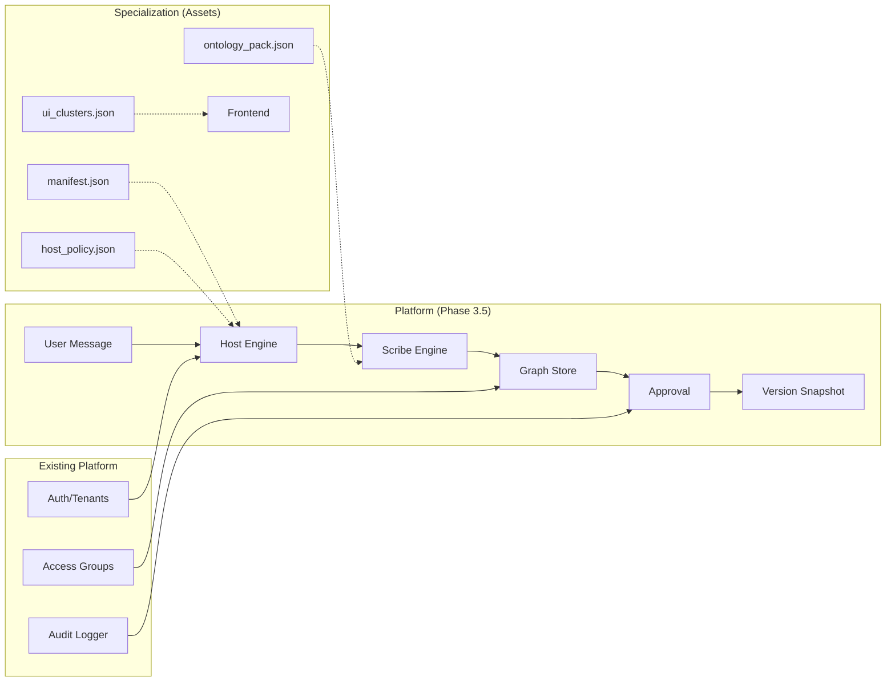

# Platform Roadmap: Verified Digital Twin Brain

> **Note:** This file extracts the platform-level phases from the main ROADMAP.md for clarity.
> Specialization-specific work lives in separate roadmaps (e.g., `VC_SPECIALIZATION_ROADMAP.md`).

---

## Status Legend

- `✅ DONE` — Wired to real auth and real persistence
- `🟡 STUB` — Placeholder or local dummy, not production-ready
- `⬜ NOT STARTED` — Absent from codebase

---

## Completed Platform Phases

| Phase | Name | Status |
|-------|------|--------|
| 1 | MVP – Grounded Answers | ✅ DONE |
| 2 | Cloud Agents & Verified Memory | ✅ DONE |
| 3 | Digital Persona & Multi-Modal Mind | ✅ DONE |
| 4 | Verified-First Knowledge Layer | ✅ DONE |
| 5 | Access Groups as First-Class Primitive | ✅ DONE |
| 6 | Mind Ops Layer | ✅ DONE |
| 7 | Omnichannel Distribution | ✅ DONE |
| 8 | Actions Engine | ✅ DONE |
| 9 | Verification & Governance (Trust Layer) | ✅ DONE |
| 10 | Enterprise Scale & Reliability | ⬜ NOT STARTED |

---

## Phase 3.5: Cognitive Brain Builder (Graph Memory + Interview + Approval)

> [!IMPORTANT]
> This phase enables domain-specific "cognitive twins" with graph memory, structured interviews, and approval workflows.
> Specializations (VC, Legal, etc.) layer on top as **configuration + assets only**.

**Status:** ✅ COMPLETE (All Gates Done)
**Effort:** Large
**Priority:** High
**Dependency:** Phase 3 (Digital Persona), Phase 5 (Access Groups), Phase 9 (Governance)

---

### Architecture Overview

```
┌─────────────────────────────────────────────────────────────────────────────┐
│                          VERIFIED DIGITAL TWIN BRAIN                        │
│                              (Platform Layer)                               │
├─────────────────────────────────────────────────────────────────────────────┤
│                                                                             │
│  ┌─────────────────────────────────────────────────────────────────────┐   │
│  │                    EXISTING PLATFORM (Phases 1-9)                   │   │
│  │  ┌──────────┐ ┌──────────┐ ┌──────────┐ ┌──────────┐ ┌──────────┐  │   │
│  │  │ Auth &   │ │ Access   │ │ Actions  │ │ Verified │ │ Audit &  │  │   │
│  │  │ Tenants  │ │ Groups   │ │ Engine   │ │ QnA      │ │ Govern.  │  │   │
│  │  └──────────┘ └──────────┘ └──────────┘ └──────────┘ └──────────┘  │   │
│  └─────────────────────────────────────────────────────────────────────┘   │
│                                    │                                        │
│                                    ▼                                        │
│  ┌─────────────────────────────────────────────────────────────────────┐   │
│  │              PHASE 3.5: COGNITIVE BRAIN BUILDER                     │   │
│  │                                                                     │   │
│  │  ┌───────────────┐    ┌───────────────┐    ┌───────────────────┐   │   │
│  │  │  HOST ENGINE  │───▶│ SCRIBE ENGINE │───▶│   GRAPH STORE     │   │   │
│  │  │               │    │               │    │                   │   │   │
│  │  │ - Interview   │    │ - Structured  │    │ - cognitive_      │   │   │
│  │  │   flow        │    │   Outputs     │    │   profiles        │   │   │
│  │  │ - Slot        │    │ - Nodes/Edges │    │ - graph_nodes     │   │   │
│  │  │   priority    │    │ - Contradic-  │    │ - graph_edges     │   │   │
│  │  │ - One Q at    │    │   tions       │    │ - profile_        │   │   │
│  │  │   a time      │    │               │    │   versions        │   │   │
│  │  └───────────────┘    └───────────────┘    └───────────────────┘   │   │
│  │                                                                     │   │
│  │  ┌─────────────────────────────────────────────────────────────┐   │   │
│  │  │              SPECIALIZATION REGISTRY                        │   │   │
│  │  │   twins.specialization_id → manifest.json → assets          │   │   │
│  │  └─────────────────────────────────────────────────────────────┘   │   │
│  └─────────────────────────────────────────────────────────────────────┘   │
│                                    │                                        │
└────────────────────────────────────┼────────────────────────────────────────┘
                                     │
                                     ▼
┌─────────────────────────────────────────────────────────────────────────────┐
│                     SPECIALIZATIONS (Config + Assets Only)                  │
├─────────────────────────────────────────────────────────────────────────────┤
│                                                                             │
│  ┌───────────────────────┐  ┌───────────────────────┐  ┌─────────────────┐ │
│  │     VC BRAIN          │  │    LEGAL BRAIN        │  │   VANILLA       │ │
│  │                       │  │    (Future)           │  │   (Default)     │ │
│  │  ├─ manifest.json     │  │  ├─ manifest.json     │  │  ├─ manifest    │ │
│  │  ├─ host_policy.json  │  │  ├─ host_policy.json  │  │  └─ (minimal)   │ │
│  │  ├─ vc_base_pack.json │  │  ├─ legal_pack.json   │  │                 │ │
│  │  ├─ ui_clusters.json  │  │  ├─ ui_clusters.json  │  │                 │ │
│  │  └─ triggers.json     │  │  └─ triggers.json     │  │                 │ │
│  │                       │  │                       │  │                 │ │
│  │  NO CODE - JUST JSON  │  │  NO CODE - JUST JSON  │  │  NO CODE        │ │
│  └───────────────────────┘  └───────────────────────┘  └─────────────────┘ │
│                                                                             │
└─────────────────────────────────────────────────────────────────────────────┘
```

### Data Flow



---

### Phase 3.5 Definition of Done

| Gate | Acceptance Criteria | Status |
|------|---------------------|--------|
| **1. Per-Twin Specialization** | `twins.specialization_id` column exists; manifest loaded per twin at runtime | ✅ DONE |
| **2. Real Tenant Guard** | `@require_tenant` tied to real auth (`get_current_user`) and Supabase RLS | ✅ DONE |
| **3. Supabase Graph Persistence** | `nodes`, `edges` tables with CRUD + RPCs for system access | ✅ DONE |
| **4. End-to-End Interview Loop** | Host → User → Scribe → Graph Store with real OpenAI Structured Outputs + Graph Search | ✅ DONE |
| **4.5. Split Brain UX** | Left Brain (Knowledge), Right Brain (Interview), Simulator pages | ✅ DONE |
| **5. Approval Versioning** | `profile_versions` table; approve creates immutable snapshot with diff; delete functions available | ✅ DONE |
| **6. Playwright E2E** | Tenant isolation tests validate unauthorized access is blocked | ✅ DONE |

---

### Gate 1: Per-Twin Specialization

**Goal:** Each twin can have its own specialization (VC, Legal, Vanilla) stored in DB, not env vars.

**Deliverables:**
- [x] **Gate 1: Per-Twin Specialization** (Dec 22)
  - [x] Schema: `specialization_id` column in `twins` table.
  - [x] API: `GET /twins/{id}/specialization`.
  - [x] Config: Load `manifest.json` dynamically based on twin ID.
- [ ] Add `twins.specialization_version` column (string, nullable)
- [ ] Remove global `DEFAULT_SPECIALIZATION` dependency from registry.py

**Exit Criteria:**
- Two twins with different specializations return different manifests
- No global specialization fallback used for guarded endpoints

---

### Gate 2: Real Tenant Guard

**Goal:** Tenant isolation enforced via real auth and Supabase RLS, not dummy placeholders.

**Deliverables:**
- [x] **Gate 2: Real Tenant Guard** (Dec 22)
  - [x] Schema: Implicit tenant ID mapping.
  - [x] RLS: Row Level Security policies generated (`migration_phase3_5_gate2_tenant_guard.sql`).
  - [x] Middleware: Auth guard + `verify_twin_access` dependency enforced.
- [ ] Replace dummy `get_current_user` in `tenant_guard.py` with real platform auth
- [ ] Replace dummy `get_twin_tenant` with real Supabase lookup
- [ ] Tie `@require_tenant` to existing Access Groups system for group checks
- [ ] Ensure no service-role bypass paths exist for cognitive endpoints
- [ ] Emit audit logs via existing `AuditLogger` from Phase 9

**Exit Criteria:**
- Cognitive endpoints reject requests from wrong tenant
- Audit logs include tenant_id, twin_id, user_id for all cognitive operations
- Unit tests pass with real auth mocks (not dummy data)

---

### Gate 3: Supabase Graph Persistence

**Goal:** Cognitive graph stored in Postgres with RLS, not in memory.

**Deliverables:**
- [ ] Migration SQL for tables:
  - `cognitive_profiles` (id, tenant_id, twin_id, status, active_packs, created_at)
  - `graph_nodes` (id, profile_id, node_type, label, value_json, confidence, source_turn_ids)
  - `graph_edges` (id, profile_id, src_node_id, rel_type, dst_node_id, value_json, confidence)
  - `graph_narratives` (id, profile_id, text, embedding VECTOR(3072), source_turn_ids)
  - `interview_sessions` (id, profile_id, blueprint_json, state, created_at)
  - `interview_turns` (id, session_id, role, content, scribe_snapshot, created_at)
  - `profile_versions` (id, profile_id, version, snapshot_json, diff_json, approved_by, approved_at)
- [ ] RLS policies: tenant isolation on all tables
- [ ] CRUD endpoints: `/cognitive/profiles`, `/cognitive/nodes`, `/cognitive/edges`
- [ ] Compiled snapshot endpoint: `GET /cognitive/profiles/{id}/snapshot`

**Exit Criteria:**
- All tables created in Supabase with RLS
- CRUD operations working via API
- Snapshot endpoint returns cluster completeness + node summaries

---

### Gate 4: End-to-End Interview Loop with Real Structured Outputs

**Goal:** Host asks questions, Scribe extracts structured data with real LLM, writes to graph.

**Deliverables:**
- [ ] Implement real OpenAI Structured Outputs call in `scribe_engine.py`
- [ ] Host reads `host_policy.json` and missing slots from graph
- [ ] Host asks one question at a time, referencing previous answers
- [ ] Scribe returns `node_updates`, `edge_updates`, `narratives`, `contradictions`
- [ ] Scribe writes to graph store after each turn
- [ ] One-hop neighbor expansion for context (allowed edge types from manifest)

**Exit Criteria:**
- `/cognitive/interview/{twin_id}` endpoint:
  - Accepts user message
  - Returns AI response + next slot + extracted data
  - Writes nodes/edges to Supabase
- LLM call uses real OpenAI Structured Outputs (not placeholder)

---

### Gate 5: Approval Versioning

**Goal:** Approve action creates immutable version with snapshot and diff.

**Deliverables:**
- [ ] `POST /cognitive/profiles/{id}/approve` endpoint
- [ ] Creates row in `profile_versions` with `snapshot_json` (full graph state)
- [ ] Computes `diff_json` from previous version
- [ ] Validation: contradictions must be resolved or explicitly deferred
- [ ] Approval emits audit log event

**Exit Criteria:**
- Approve creates immutable version row
- Subsequent edits create new draft, not modify approved version
- Audit log shows who approved, when, and what changed

---

### Gate 6: Playwright E2E Tenant Isolation

**Goal:** Prove tenant isolation works end-to-end.

**Deliverables:**
- [ ] Create `tests/e2e/tenant_isolation.spec.ts` Playwright test
- [ ] Test scenario:
  1. Tenant A creates twin with cognitive profile
  2. Tenant A runs interview, writes nodes and edges
  3. Tenant A approves profile → creates version
  4. Tenant B attempts to access Tenant A's graph by guessing IDs
  5. Assert: Tenant B receives 403 Forbidden

**Exit Criteria:**
- Test passes in CI
- Tenant B cannot read, write, or approve Tenant A's graph

---

## Current Focus

> [!NOTE]
> **Phase 3.5: Cognitive Brain Builder is COMPLETE!** All gates implemented and working.

**Current Priority:** Phase 10 (Enterprise Scale & Reliability)
- Observability (metrics, tracing)
- Cost controls (quotas, caching)
- Deployment hardening (job queues, autoscaling, DR)

---

## Future Platform Phases

### Phase 10: Enterprise Scale & Reliability
- Observability (metrics, tracing)
- Cost controls (quotas, caching)
- Deployment hardening (job queues, autoscaling, DR)
