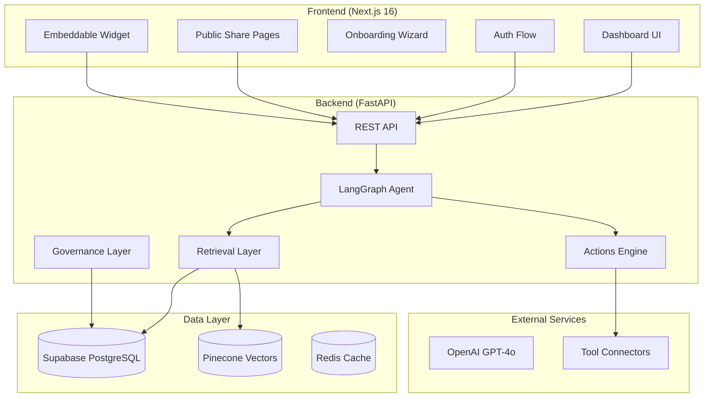

# Verified Digital Twin Brain - Platform Summary

> Repository: [https://github.com/snsettitech/verified-digital-twin-brains](https://github.com/snsettitech/verified-digital-twin-brains)

A **Delphi-grade** AI platform for creating verified, trustworthy digital twins with enterprise-level governance, multi-audience distribution, and agentic capabilities.

## Executive Summary

This platform enables creators to build AI-powered digital twins that can represent them authentically, answer questions from their verified knowledge base, take actions on their behalf (with approval), and scale across multiple channels while maintaining trust and accountability.

### Key Differentiators
- **Verified-First Knowledge**: Canonical answers that never regress after owner approval
- **Access Group Segmentation**: Different audiences see different knowledge and capabilities
- **Human-in-the-Loop Actions**: AI can draft actions, but humans approve before execution
- **Immutable Audit Trail**: Complete provenance for compliance and accountability
- **Omnichannel Distribution**: Embed widgets, share links, API access with rate limiting

---

## Quick Start

### Preflight Check (run before every push)
```powershell
# Windows
./scripts/preflight.ps1

# Linux/Mac
./scripts/preflight.sh
```

### Apply Jobs/Logs Migration
```sql
-- Run in Supabase SQL Editor:
-- backend/migrations/create_jobs_tables.sql
```

### Documentation
- `docs/ops/AGENT_BRIEF.md` - How to work in this repo
- `docs/ops/RUNBOOKS.md` - Troubleshooting guides
- `docs/ops/LEARNINGS_LOG.md` - Lessons learned ledger

### Jobs Dashboard
Navigate to `/dashboard/jobs` to view background job status and logs.

---

## Architecture Overview



---

## Technology Stack

| Layer | Technology |
|-------|------------|
| **Frontend** | Next.js 16, TypeScript, Tailwind CSS, Supabase Auth |
| **Backend** | FastAPI, Python 3.12, LangGraph, LangChain |
| **Database** | PostgreSQL (Supabase), Pinecone (Vectors) |
| **AI Models** | OpenAI GPT-4o, Cohere Reranker |
| **Infrastructure** | Railway, Vercel |
| **Tools** | Composio (Gmail, Calendar, Webhooks) |

---

## Completed Phases

### Phase 1-3: Core Foundation ✅
- Multi-tenant database with RLS
- Document ingestion (PDF, URLs, Social Media)
- RAG-based chat with citations
- Confidence-based escalation workflow
- HyDE query expansion
- Persona encoding

### Phase 3.5: Cognitive Brain Builder ✅
- Per-twin specialization manifests
- Cognitive graph (nodes/edges) storage
- Interview Host/Scribe loop
- Split Brain UX (Left/Right Brain)
- Profile versioning with snapshots

### Phase 4: Verified-First Knowledge ✅
- `verified_qna` table for canonical answers
- Answer patches and versioning
- Retrieval priority: Verified → Vector → Tools
- "I don't know" policy enforcement

### Phase 5: Access Groups ✅
- Full segmentation system
- `access_groups`, `group_memberships`, `content_permissions`
- Group-level limits and overrides
- Content visibility per group

### Phase 6: Mind Ops Layer ✅
- Content staging dock
- Training jobs queue
- Health checks (duplicates, empty)
- Ingestion observability logs

### Phase 7: Omnichannel Distribution ✅
- Embeddable widget (`widget.js`)
- API keys with domain allowlists
- Public share links with token validation
- Anonymous/authenticated sessions
- User invitation workflow

### Phase 8: Actions Engine ✅
- Event model (message, escalation, idle)
- Trigger system with conditions
- Draft → Approve → Execute pipeline
- Tool connectors (Gmail, Calendar, Webhook)
- Complete audit logging

### Phase 9: Verification & Governance ✅
- Identity verification workflow
- Immutable audit logs
- Deep scrub (database + vectors)
- GuardrailEngine for safety
- Governance policies per group

---

## Project Structure

```
verified-digital-twin-brain/
├── backend/
│   ├── main.py                 # FastAPI entry point
│   ├── worker.py               # Background job worker
│   ├── routers/                # 13 API routers
│   │   ├── chat.py             # Chat endpoints
│   │   ├── auth.py             # Authentication
│   │   ├── actions.py          # Actions engine API
│   │   ├── governance.py       # Audit/policies API
│   │   ├── cognitive.py        # Interview/graph API
│   │   └── ...
│   ├── modules/                # 25 business logic modules
│   │   ├── agent.py            # LangGraph agent
│   │   ├── actions_engine.py   # Actions pipeline
│   │   ├── governance.py       # Audit logging
│   │   ├── access_groups.py    # Access control
│   │   ├── verified_qna.py     # Verified answers
│   │   ├── retrieval.py        # Vector search
│   │   └── ...
│   └── database/
│       ├── schema/             # Base schema
│       └── migrations/         # 12 migration files
│
├── frontend/
│   ├── app/                    # Next.js 16 app router
│   │   ├── auth/               # Login/signup/callback
│   │   ├── dashboard/          # 17 dashboard sections
│   │   │   ├── access-groups/
│   │   │   ├── actions/
│   │   │   ├── governance/
│   │   │   ├── knowledge/
│   │   │   ├── right-brain/
│   │   │   └── ...
│   │   ├── onboarding/         # 8-step wizard
│   │   └── share/              # Public share pages
│   ├── components/             # Reusable UI components
│   │   ├── cognitive/          # Split brain UI
│   │   ├── console/            # Twin console
│   │   ├── onboarding/         # Wizard steps
│   │   └── ui/                 # Premium components
│   └── lib/                    # Utilities and API
│
├── docs/                       # Documentation
├── scripts/                    # Deployment scripts
└── .github/workflows/          # CI/CD pipelines
```

---

## Database Schema

### Core Tables
| Table | Purpose |
|-------|---------|
| `twins` | Digital twin instances |
| `tenants` | Multi-tenant isolation |
| `users` | User accounts |
| `sources` | Ingested content |
| `chunks` | Document chunks |

### Knowledge Layer
| Table | Purpose |
|-------|---------|
| `verified_qna` | Canonical verified answers |
| `answer_patches` | Answer version history |
| `citations` | Source references |
| `escalations` | Low-confidence questions |

### Access Control
| Table | Purpose |
|-------|---------|
| `access_groups` | Audience segments |
| `group_memberships` | User-group mapping |
| `content_permissions` | Content visibility |
| `group_limits` | Rate limits per group |

### Actions Engine
| Table | Purpose |
|-------|---------|
| `events` | System event log |
| `action_triggers` | Trigger rules |
| `action_drafts` | Pending actions |
| `action_executions` | Execution history |
| `tool_connectors` | External integrations |

### Governance
| Table | Purpose |
|-------|---------|
| `audit_logs` | Immutable audit trail |
| `governance_policies` | Per-group policies |
| `twin_verification` | Identity verification |

---

## API Endpoints

### Core Chat
- `POST /chat/{twin_id}` - Send message to twin
- `POST /public/chat/{twin_id}/{token}` - Public chat with share link

### Knowledge Management
- `POST /ingest/document` - Upload document
- `GET /sources/{twin_id}` - List sources
- `POST /twins/{twin_id}/verified-qna` - Add verified answer

### Access Groups
- `GET /twins/{twin_id}/access-groups` - List groups
- `POST /access-groups` - Create group
- `POST /access-groups/{id}/permissions` - Set permissions

### Actions Engine
- `GET /twins/{twin_id}/triggers` - List triggers
- `GET /twins/{twin_id}/action-drafts` - Pending actions
- `POST /action-drafts/{id}/approve` - Approve action

### Governance
- `GET /twins/{twin_id}/audit-logs` - Audit trail
- `POST /twins/{twin_id}/verify` - Start verification

---

## Getting Started

### Prerequisites
- Python 3.10+
- Node.js 20+
- Accounts: Supabase, Pinecone, OpenAI

### Quick Start

```bash
# Backend
cd backend
python -m venv .venv
source .venv/bin/activate  # or .venv\Scripts\activate on Windows
pip install -r requirements.txt
cp .env.example .env
# Fill in API keys
python main.py

# Frontend (new terminal)
cd frontend
npm install
cp .env.local.example .env.local
# Fill in API keys
npm run dev
```

### Database Migrations

Run in Supabase SQL Editor in order:
1. `backend/database/schema/supabase_schema.sql`
2. `backend/database/migrations/migration_phase4_verified_qna.sql`
3. `backend/database/migrations/migration_phase5_access_groups.sql`
4. `backend/database/migrations/migration_phase6_mind_ops.sql`
5. `backend/database/migrations/migration_phase7_omnichannel.sql`
6. `backend/database/migrations/migration_phase8_actions_engine.sql`
7. `backend/database/migrations/migration_phase9_governance.sql`
8. `backend/migrations/enable_rls_all_tables.sql` (Security hardening)

---

## Security

- **Row Level Security (RLS)**: Enabled on all 26 public tables
- **Service Role Access**: Backend uses service_role for full access
- **API Key Validation**: Domain allowlists, rate limiting
- **Session Management**: Token-based with expiration
- **Audit Logging**: Immutable append-only logs
- **Guardrails**: Prompt injection detection

---

## Roadmap

### Completed ✅
- Phases 1-9: Core platform, knowledge, access control, actions, governance

### Phase 10: Enterprise Scale (Vision)
- [ ] Comprehensive observability (metrics, tracing)
- [ ] Cost controls and quotas
- [ ] Background job queue (Redis/SQS)
- [ ] Autoscaling and disaster recovery

### Phase 10: Enterprise Scale ✅ BETA READY
- [x] Metrics collection and dashboards
- [x] Enhanced health checks (Supabase, Pinecone, OpenAI)
- [x] Usage quotas per tenant
- [x] Agent instrumentation (latency tracking)
- [ ] Background job queue (deferred)
- [ ] Autoscaling (deferred)

---

## License

MIT

