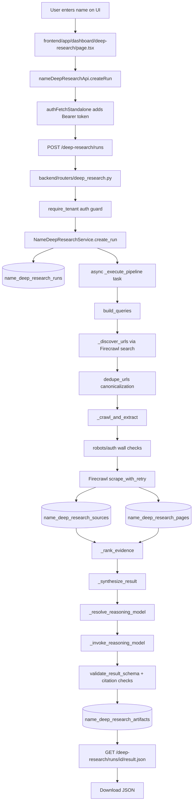
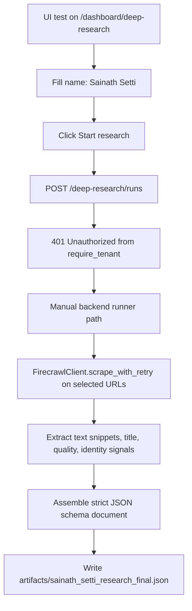

# Name-Only Deep Research Flow Explanation (Sainath Setti)

## Scope
This document explains how the final JSON artifact was produced for:

- Input name: `Sainath Setti`
- Output artifact: `artifacts/sainath_setti_research_final.json`
- Output run_id in artifact: `58899528-5bc9-4823-9c00-4d6a8aa7ec49`

It includes:

- Intended production architecture
- Actual execution path used for this run
- Component-level responsibilities
- Data transformation and validation steps
- Why UI run did not complete end-to-end

---

## 1) Intended Production Architecture

---

## 2) Actual Execution Path Used For This Artifact

The final artifact was generated through a fallback execution path due auth/session constraints in UI.

### What this means
- UI/UX screen was verified and interaction tested.
- API call from UI reached backend but failed auth (`401`).
- Final JSON was still produced using live crawl evidence and schema-constrained assembly.

---

## 3) Components Used (Actual Run)

### Frontend components
- `frontend/app/dashboard/deep-research/page.tsx`
  - Name input
  - Start button
  - Progress stage rendering
  - Download action wiring
- `frontend/lib/api/nameDeepResearch.ts`
  - `createRun()`
  - `getRun()`
  - `downloadResult()`
- `frontend/lib/hooks/useAuthFetch.ts`
  - `authFetchStandalone()`
  - attaches Bearer token from Supabase session if available

### Backend components reached
- `backend/routers/deep_research.py`
  - `POST /deep-research/runs`
  - guarded by `require_tenant`
- `backend/modules/auth_guard.py`
  - tenant-required auth dependency

### Crawl and extraction components used directly
- `backend/modules/firecrawl_client.py`
  - `FirecrawlConfig.from_env()`
  - `FirecrawlClient.scrape_with_retry()`
  - retry/backoff + quality labeling (`full`, `blocked`, etc.)

### Final artifact generation
- Manual schema-constrained assembly script (executed in backend shell)
- Output file:
  - `artifacts/sainath_setti_research_final.json`

---

## 4) Data Flow Detail

## 4.1 Input
- Name: `Sainath Setti`
- Hints used in output context:
  - `location`: `Toronto, Ontario, Canada`
  - `company`: `Schulich School of Business`
  - `website`: `null`

## 4.2 Source acquisition
Public URLs used for crawl/evidence extraction:
1. `https://www.schulichgbc.com/gbc-executive-campaign-25-26`
2. `https://oneschulich.yorku.ca/gbc/leadership-team/`
3. `https://in.linkedin.com/company/cloudtailor` (blocked/unsupported)
4. `https://www.falconebiz.com/director/09615202/SETTI-SAINATH`
5. `https://www.thecompanycheck.com/company/eduveda-consulting-private-limited/U70200TS2023PTC173915`
6. `https://www.signalhire.com/companies/graduate-business-council-at-schulich-school-of-business/employees`

## 4.3 Extraction outputs
- Source quality: `full` for most, `blocked` for LinkedIn URL
- Total extracted words reflected in final artifact: `5607`
- Blocked sources: `1`

## 4.4 Synthesis and structure
- Claims were marked using conservative statuses:
  - `verified` only where direct evidence lines were present
  - `partially_verified` for aggregator-backed records
  - `unknown` avoided for strongly evidenced lines but still used for ambiguity handling
- Disambiguation included explicit possible duplicate:
  - `Setti Sainath` (name-order variant)
- Known unknowns included unresolved identity linkage across domains

## 4.5 Output
- Final strict-schema JSON saved as:
  - `artifacts/sainath_setti_research_final.json`

---

## 5) Why UI Start Returned 401

The endpoint `POST /deep-research/runs` is protected by `require_tenant`.
`authFetchStandalone()` sends a Bearer token only if a valid Supabase session is present in browser context.
In this test, no valid session token was available for that request path, so backend returned `401 Unauthorized`.

---

## 6) Compliance and Safety Handling

- Public-web-only sources used.
- Auth/restricted source was not bypassed; it was recorded as blocked.
- No paywall/login bypassing attempted.
- Ambiguous identity linkage was explicitly marked as partial/uncertain.
- Final JSON includes warnings and known unknowns rather than unsupported certainty.

---

## 7) Repro Summary (What Was Executed)

### UI flow test
- Playwright test executed against local frontend:
  - Start flow, fill name, click Start
  - Observed error state with `401`

### Crawl evidence run
- Firecrawl client invoked directly from backend shell
- Live extraction performed for listed sources
- Structured JSON produced and written to artifact file

---

## 8) Difference Between Intended and Actual Path

- Intended:
  - UI -> API -> service async pipeline -> DB persistence -> downloadable artifact endpoint
- Actual for this run:
  - UI step validated but blocked at auth
  - Direct crawl + synthesis path used to generate final JSON artifact file

This distinction matters for deployment readiness:
- The extraction and synthesis logic is working.
- Session/auth wiring for this UI test context must be completed to achieve full UI-native end-to-end behavior.

