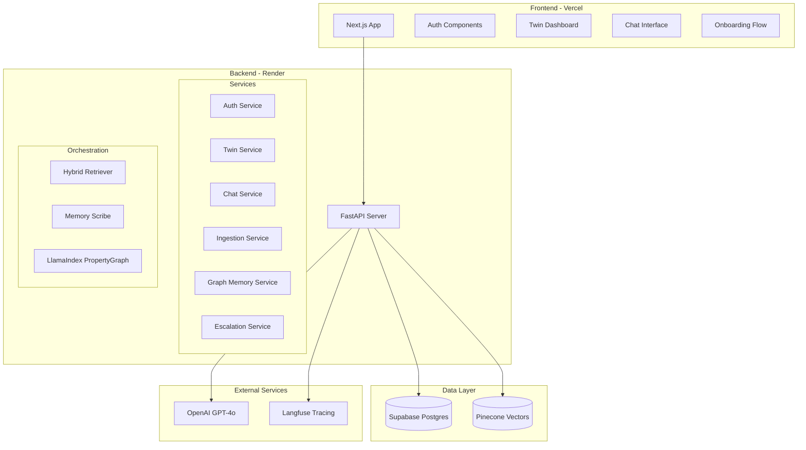
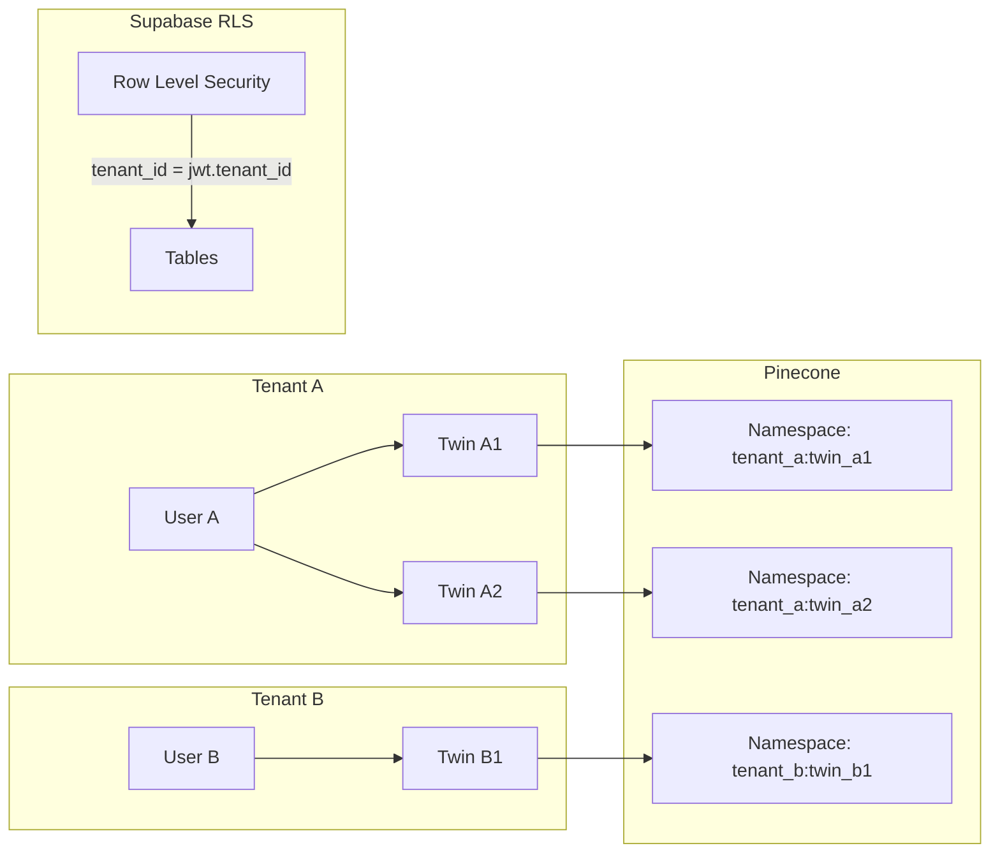
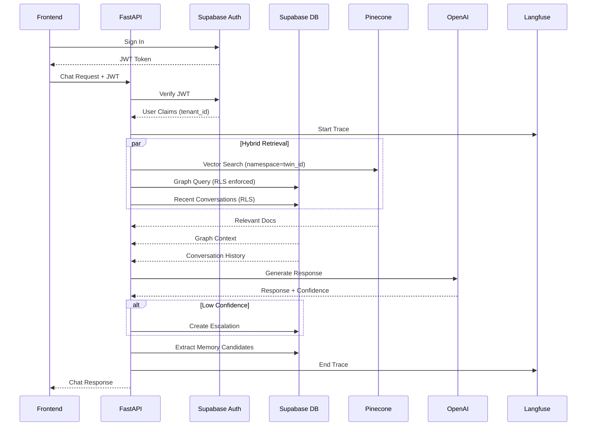
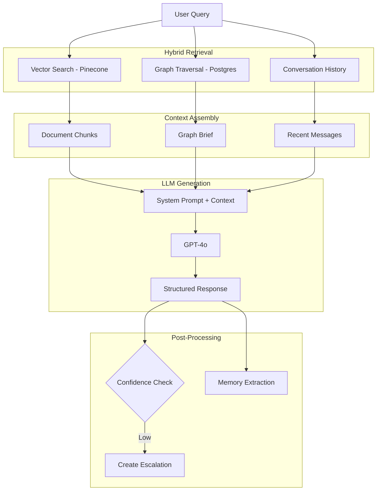
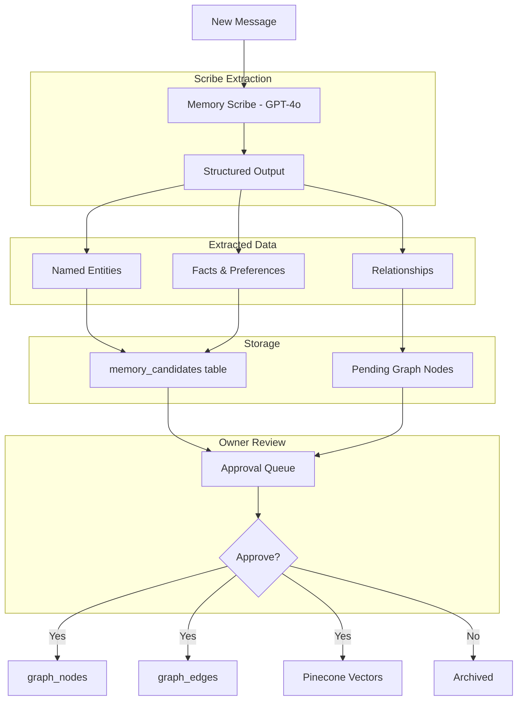

# Digital Brain Architecture

> A Delphi-level Digital Brain MVP that learns day by day with multi-tenant isolation.

## System Overview



## Multi-Tenant Isolation Model



## Database Schema

```mermaid
erDiagram
    tenants ||--o{ users : has
    users ||--o{ twins : owns
    twins ||--o{ documents : contains
    twins ||--o{ conversations : has
    twins ||--o{ graph_nodes : has
    twins ||--o{ memory_candidates : has
    twins ||--o{ escalations : has
    conversations ||--o{ messages : contains
    graph_nodes ||--o{ graph_edges : from
    graph_nodes ||--o{ graph_edges : to
    
    tenants {
        uuid id PK
        text name
        jsonb settings
        timestamp created_at
    }
    
    users {
        uuid id PK
        uuid tenant_id FK
        text email
        text role
        timestamp created_at
    }
    
    twins {
        uuid id PK
        uuid tenant_id FK
        uuid owner_id FK
        text name
        text description
        text specialization
        jsonb personality
        text onboarding_status
        timestamp created_at
    }
    
    documents {
        uuid id PK
        uuid twin_id FK
        uuid tenant_id FK
        text title
        text content
        text source_type
        jsonb metadata
        text processing_status
        timestamp created_at
    }
    
    conversations {
        uuid id PK
        uuid twin_id FK
        uuid tenant_id FK
        uuid user_id FK
        text mode
        jsonb context
        timestamp created_at
    }
    
    messages {
        uuid id PK
        uuid conversation_id FK
        uuid tenant_id FK
        text role
        text content
        jsonb tool_calls
        jsonb metadata
        timestamp created_at
    }
    
    graph_nodes {
        uuid id PK
        uuid twin_id FK
        uuid tenant_id FK
        text node_type
        text name
        text description
        jsonb properties
        float[] embedding
        timestamp created_at
    }
    
    graph_edges {
        uuid id PK
        uuid from_node_id FK
        uuid to_node_id FK
        uuid tenant_id FK
        text relationship_type
        float weight
        jsonb properties
        timestamp created_at
    }
    
    memory_candidates {
        uuid id PK
        uuid twin_id FK
        uuid tenant_id FK
        uuid source_message_id FK
        text content
        text memory_type
        text status
        jsonb extracted_entities
        timestamp created_at
        timestamp reviewed_at
    }
    
    escalations {
        uuid id PK
        uuid twin_id FK
        uuid tenant_id FK
        uuid source_conversation_id FK
        text question
        text context
        text status
        text owner_response
        boolean add_to_brain
        timestamp created_at
        timestamp resolved_at
    }
```

## API Architecture



## Chat Retrieval Pipeline



## Memory Write Pipeline



## Security Model

| Layer | Mechanism | Enforcement |
|-------|-----------|-------------|
| Auth | Supabase Auth JWT | Every API request |
| API | FastAPI Depends | Route middleware |
| Database | Supabase RLS | Policy per table |
| Vectors | Pinecone Namespace | `tenant_id:twin_id` |
| LLM | No PII in prompts | Input sanitization |

## Technology Stack

| Component | Technology | Purpose |
|-----------|------------|---------|
| Frontend | Next.js 14 | SSR, React, TypeScript |
| Backend | FastAPI | Async API, Pydantic |
| Auth | Supabase Auth | JWT, Social logins |
| Database | Supabase Postgres | RLS, real-time |
| Vectors | Pinecone | Semantic search |
| Graph | Postgres + LlamaIndex | Property graph |
| LLM | GPT-4o | Generation, extraction |
| Tracing | Langfuse | Observability |
| Eval | RAGAS | RAG quality metrics |

## Directory Structure

```
deep-kuiper/
├── frontend/                  # Next.js application
│   ├── app/                   # App router pages
│   ├── components/            # React components
│   ├── lib/                   # Utilities, API client
│   └── styles/                # CSS modules
│
├── backend/                   # FastAPI application
│   ├── app/
│   │   ├── api/              # Route handlers
│   │   │   ├── auth.py
│   │   │   ├── twins.py
│   │   │   ├── chat.py
│   │   │   ├── documents.py
│   │   │   ├── memory.py
│   │   │   └── escalations.py
│   │   ├── core/             # Core utilities
│   │   │   ├── config.py
│   │   │   ├── security.py
│   │   │   └── dependencies.py
│   │   ├── services/         # Business logic
│   │   │   ├── retrieval.py
│   │   │   ├── scribe.py
│   │   │   ├── graph.py
│   │   │   └── llm.py
│   │   ├── models/           # Pydantic models
│   │   └── db/               # Database utilities
│   ├── tests/                # Pytest tests
│   └── requirements.txt
│
├── supabase/                  # Supabase config
│   ├── migrations/           # SQL migrations
│   └── seed.sql              # Test data
│
├── docs/                      # Documentation
│   ├── architecture.md
│   ├── api_contracts.md
│   ├── security.md
│   └── e2e_tests.md
│
├── scripts/                   # Utility scripts
│
└── .env.example              # Environment template
```
