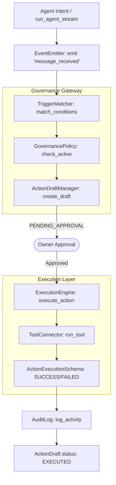

# Action Flow

```mermaid
graph TD
    Intent[Agent Intent / run_agent_stream] --> EventBus[EventEmitter: emit 'message_received']
    EventBus --> Matcher[TriggerMatcher: match_conditions]
    
    subgraph "Governance Gateway"
        Matcher --> Policy[GovernancePolicy: check_active]
        Policy --> Draft[ActionDraftManager: create_draft]
    end

    Draft -- PENDING_APPROVAL --> Owner([Owner Approval])
    Owner -- Approved --> Execution[ExecutionEngine: execute_action]
    
    subgraph "Execution Layer"
        Execution --> Connector[ToolConnector: run_tool]
        Connector --> Result[ActionExecutionSchema: SUCCESS/FAILED]
    end

    Result --> Logging[AuditLog: log_activity]
    Logging --> Finalize[ActionDraft.status: EXECUTED]
```
