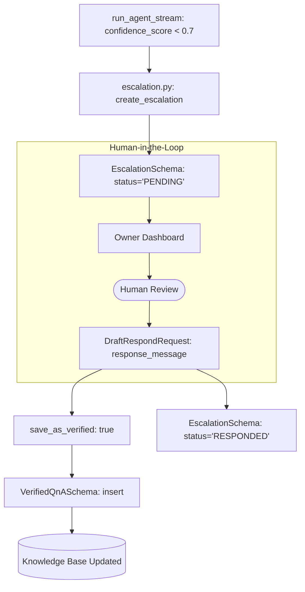

# Escalation Flow

```mermaid
graph TD
    Confidence[run_agent_stream: confidence_score < 0.7] --> Router[escalation.py: create_escalation]
    Router --> Queue[EscalationSchema: status='PENDING']
    
    subgraph "Human-in-the-Loop"
        Queue --> Dashboard[Owner Dashboard]
        Dashboard --> Review([Human Review])
        Review --> Respond[DraftRespondRequest: response_message]
    end

    Respond --> Memory[save_as_verified: true]
    Memory --> Update[VerifiedQnASchema: insert]
    
    Respond --> Finalize[EscalationSchema: status='RESPONDED']
    Update --> KnowledgeBase[(Knowledge Base Updated)]
```
