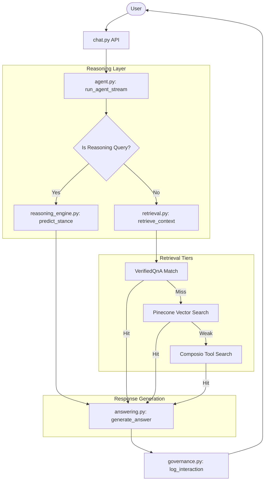

# Query Flow

```mermaid
graph TD
    User([User]) --> API[chat.py API]
    API --> Orchestrator[agent.py: run_agent_stream]
    
    subgraph "Reasoning Layer"
        Orchestrator --> Reasoning{Is Reasoning Query?}
        Reasoning -- Yes --> GraphRAG[reasoning_engine.py: predict_stance]
        Reasoning -- No --> RetrievalTier[retrieval.py: retrieve_context]
    end

    subgraph "Retrieval Tiers"
        RetrievalTier --> Tier1[VerifiedQnA Match]
        Tier1 -- Miss --> Tier2[Pinecone Vector Search]
        Tier2 -- Weak --> Tier3[Composio Tool Search]
    end

    subgraph "Response Generation"
        GraphRAG --> Synthesizer[answering.py: generate_answer]
        Tier1 -- Hit --> Synthesizer
        Tier2 -- Hit --> Synthesizer
        Tier3 -- Hit --> Synthesizer
    end

    Synthesizer --> Audit[governance.py: log_interaction]
    Audit --> User
```
