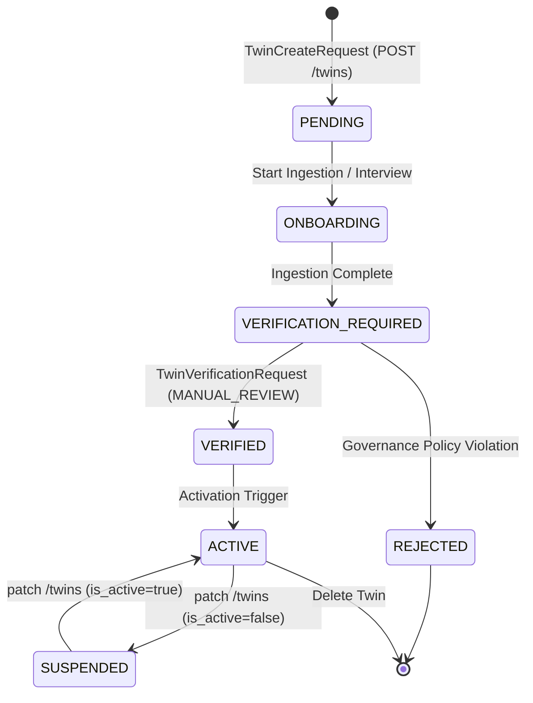

# Twin Lifecycle

```mermaid
stateDiagram-v2
    [*] --> PENDING : TwinCreateRequest (POST /twins)
    PENDING --> ONBOARDING : Start Ingestion / Interview
    ONBOARDING --> VERIFICATION_REQUIRED : Ingestion Complete
    VERIFICATION_REQUIRED --> VERIFIED : TwinVerificationRequest (MANUAL_REVIEW)
    VERIFICATION_REQUIRED --> REJECTED : Governance Policy Violation
    VERIFIED --> ACTIVE : Activation Trigger
    ACTIVE --> SUSPENDED : patch /twins (is_active=false)
    SUSPENDED --> ACTIVE : patch /twins (is_active=true)
    REJECTED --> [*]
    ACTIVE --> [*] : Delete Twin
```
